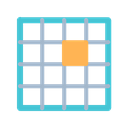

# Haige’s Cinema 4D Scripts

我的 Cinema 4D Python 脚本合集，整理日常工作中使用的对象、建模和场景辅助工具。所有脚本使用 **HG_** 前缀，配有独立图标。

## 使用方法

主要使用环境为 **Windows / Cinema 4D 2025**，部分脚本已在 **2025.3.3** 验证。各脚本的适用范围见下方说明，首次使用建议在场景副本中操作。

### 安装

1. [下载脚本合集](https://github.com/haigeplay3d/c4d_scripts/archive/refs/heads/main.zip)并解压。
2. 在 C4D 的 Preferences（偏好设置）中点击 **Open Preferences Folder（打开偏好设置文件夹）**，进入 `library/scripts`。
3. 将下载项目中包含各工具的 **内层 `c4d_scripts` 文件夹**复制进去。保留脚本 `.py` 和同名图标 `.tif` 相邻。
4. 保存当前工作并重启 C4D，让软件加载新脚本。

已配置额外脚本目录的用户也可以放入自己的脚本目录，无需重复安装。

### 运行

按 **Shift+C** 打开 Commander（命令搜索），输入 **HG_** 查找脚本，也可以从用户脚本菜单运行或添加到工具栏。

部分工具要求特定的对象类型、选择顺序或修饰键。运行前可在本页找到对应文件名，查看说明。临时试用时，也可以在 Script Manager（脚本管理器）中直接打开 `.py` 文件运行。

## 脚本说明

## 对象与场景

###  HG_AnnotationFromName.py

**对象名称注释**

选中对象后运行，创建控制标签，将对象名称持续同步到注释。选择范围包含子级。

[详细说明](c4d_scripts/AnnotationFromName/README.md) · [脚本](c4d_scripts/AnnotationFromName/HG_AnnotationFromName.py)

###  HG_DeleteNulls.py

**删除空对象并保留子级**

选中对象或层级根后运行，递归删除其中的 Null，将子对象提升到上一级并保持顺序。包含有子级的 Null；绑定和约束场景请先查看详细说明。

[详细说明](c4d_scripts/DeleteNulls/README.md) · [脚本](c4d_scripts/DeleteNulls/HG_DeleteNulls.py)

###  HG_TagsSameColor.py

**图标随图层着色**

选中一个已分配图层的对象，添加控制标签，让对象和标签的图标颜色持续跟随图层颜色。

[详细说明](c4d_scripts/TagsSameColor/README.md) · [脚本](c4d_scripts/TagsSameColor/HG_TagsSameColor.py)

## 坐标与尺寸

###  HG_PositionWorldFollow.py

**复制世界变换**

依次选择来源对象、目标对象后运行，将来源的位置、旋转和缩放复制给目标。选中多个对象时使用最后两个；执行一次复制。

[详细说明](c4d_scripts/PositionWorldFollow/README.md) · [脚本](c4d_scripts/PositionWorldFollow/HG_PositionWorldFollow.py)

###  HG_FigureScale.py

**按目标尺寸等比缩放**

选中一个对象，在窗口中修改 SourceX、SourceY 或 SourceZ 的目标尺寸并确认。以最后编辑的轴计算等比缩放比例。尺寸按对象本地包围盒轴在世界空间的长度计算。

[详细说明](c4d_scripts/FigureScale/README.md) · [脚本](c4d_scripts/FigureScale/HG_FigureScale.py)

###  HG_RoundXYZ.py

**坐标与角度取整**

**默认：** 位置取整数。  
**Alt：** 仅处理角度，保留一位小数。  
**Shift：** 同时处理位置和角度。  
Shift 与 Alt 同时按下时按 Shift 处理。

[详细说明](c4d_scripts/RoundXYZ/README.md) · [脚本](c4d_scripts/RoundXYZ/HG_RoundXYZ.py)

## 平面辅助

###  HG_PlaneLockRatio.py

**锁定平面宽高比例**

选中一个参数化 Plane，运行后添加 Python 标签，持续联动宽高以保持比例。

[详细说明](c4d_scripts/PlaneLockRatio/README.md) · [脚本](c4d_scripts/PlaneLockRatio/HG_PlaneLockRatio.py)

###  HG_SquareSegementsForPlane.py

**平面正方形分段**

选中一个参数化 Plane，运行后添加 Python 标签，根据宽高和分段数联动另一方向的分段数，使网格接近正方形。

[详细说明](c4d_scripts/SquareSegementsForPlane/README.md) · [脚本](c4d_scripts/SquareSegementsForPlane/HG_SquareSegementsForPlane.py)

## 变形与开关

###  HG_DeformerToggle.py

**切换变形器可见性**

选中对象或层级根，切换其内部受支持变形器的编辑器可见性参数。

[详细说明](c4d_scripts/DeformerToggle/README.md) · [脚本](c4d_scripts/DeformerToggle/HG_DeformerToggle.py)

###  HG_RadialStretch.py

**圆环径向拉伸**

选中局部 XZ 平面内的可编辑同心圆环，自动添加公式变形器和中文控制标签。通过“内圈偏移 / 外圈偏移 / 整体强度”调整形状。内圈偏移为 0 时可保持内圈不动，仅拉伸外圈。

[详细说明](c4d_scripts/RadialStretch/README.md) · [脚本](c4d_scripts/RadialStretch/HG_RadialStretch.py)

###  HG_C4D_BatchDisableBasicEnabled.py

**全场景关闭启用开关**

无需选择对象，遍历整个场景层级，将开启的 Basic Enabled（启用）设为关闭。作用范围为整个场景。

[详细说明](c4d_scripts/C4D_BatchDisableBasicEnabled/README.md) · [脚本](c4d_scripts/C4D_BatchDisableBasicEnabled/HG_C4D_BatchDisableBasicEnabled.py)

## 材质

###  HG_RandomColorStandardMaterial.py

**随机标准材质颜色**

为选中对象及子级创建标准材质，或修改首个纹理标签所引用的标准材质颜色。共享材质的颜色变化会影响其他使用该材质的对象。

[详细说明](c4d_scripts/RandomColorStandardMaterial/README.md) · [脚本](c4d_scripts/RandomColorStandardMaterial/HG_RandomColorStandardMaterial.py)

## 个人设置

###  HG_presetsbyhaigec4d.py

**海哥的偏好设置**

应用个人常用的界面、视图、文件、撤销和导入等软件设置。运行前请查看源码中的设置项并记录原设置，不能依靠场景撤销恢复。

[详细说明](c4d_scripts/PresetsByHaigeC4D/README.md) · [脚本](c4d_scripts/PresetsByHaigeC4D/HG_presetsbyhaigec4d.py)

## 参考与致谢

参考了 [Aturtur’s Cinema 4D Scripts](https://github.com/aturtur/cinema4d-scripts) 的脚本合集展示方式，感谢作者分享 Cinema 4D 脚本与使用经验。
