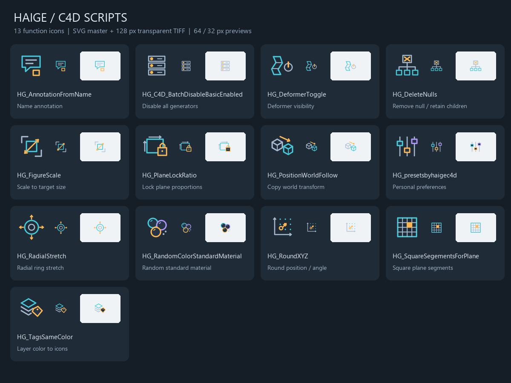

# 脚本图标

每个 `HG_*.py` 旁都配有完全同名的 `.tif`：128×128、RGBA、透明背景。复制脚本时请保留同名图标。

若运行中的 Script Manager 未显示新图标，可选中脚本，使用 File → Load Icon… 加载旁边的 TIF。菜单和工具栏是否即时刷新，需要在本机确认；保存当前工作后再按需重启。

从旧名称升级到 HG_ 名称时，已有工具栏按钮和快捷键可能需要重新关联。不要在加载目录同时保留新旧两份脚本。

图标均为本项目原创几何图形。已检查文件格式、透明度和小尺寸预览；C4D 内实际显示仍需用户确认。

[Maxon C4D 2025：Script Manager 与 Load Icon](https://help.maxon.net/c4d/2025/en-us/Content/html/5896.html)
